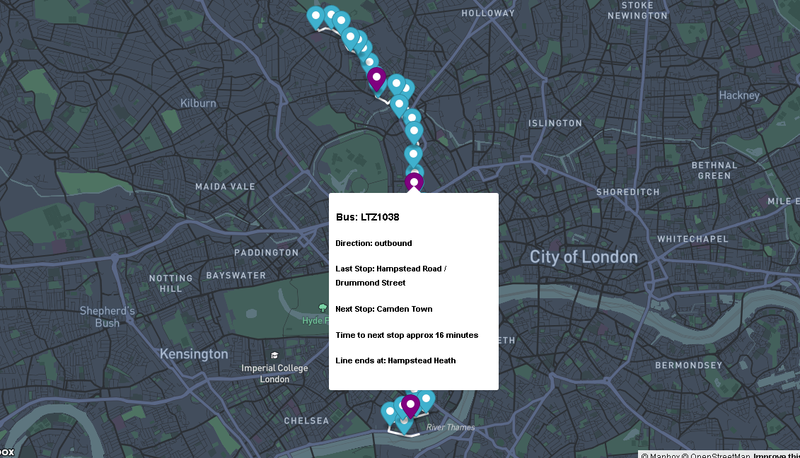

# Project Name
> Real Time Bus Tracker

## Table of contents
* [General info](#general-info)
* [Screenshots](#screenshots)
* [Technologies](#technologies)
* [Setup](#setup)
* [Features](#features)
* [Status](#status)
* [Inspiration](#inspiration)
* [Contact](#contact)

## General info
This project was introduced to introduce multiple challenges:
* Use asynchronous code to make API calls
* Utilize data recieved from those API calls to track in real time
* Use the Mapbox JavaScript library to build a map to track a bus

Our original project was to the the MBTA (Massachusetts Bay Transit Authority) and track bus 1 that runs from MIT to Harvard in real time. After the assignment was submitted, we were encouraged to take what we learned and use other APIs and customize our maps for more practice and see what we can do. I chose to leave the US and try using the London Transport API. I setup custom styles for the map and was inspired by a document I found when searching for information about bus routes in London to try and tackle, not one, but 22 different bus lines. I used the tutorials on Mapbox and created a nav bar to select a line, and when selected the map will look at the coordinates of the bus stops on that line and zoom in to make that line the focus. Each bus stop is marked on the map with a blue marker, and has a popup when clicked that gives the name of the stop as well as the other lines that connect to that stop. During operating hours the buses are marked with purple makers that display INFORMATION HERE. My biggest challenge here wa that the busses don't have live GPS tracking, but rather just the last stop they were at in Naptan codes. I ended up finding CSV files with data that corresponded the Naptan codes with the bus stop coordinates. With that I could give the busses latitudinal and longitudeinal coo4rdinates. Also the live bus data listed some busses twice as it was more of a live feed than a regenerated document. I had to filter out old bus data to make sure I had the most current location data. 

## Screenshots

## Technologies
* HTML
* CSS
* JavaScript

## Setup
Feel free to fork it and make your own changes. You can also download the files to your local machine, unzip them into a folder, and view it in your local browser. Or you can check out the project here (https://danielwestfall.github.io/realTimeBusTracker/realTimeBusTracker.html). 

Click on any of the lines listed on the right hand side of the page and it will show you the latest from that bus line. Do note that the London bus service does not run 24 hours a day. During the night no busses will be shown.

## Features
List of features ready:
* Multiple bus lines are available.
* Zoom in on individual lines.
* Bus and stop location data in popups.

To-do list:
* CSS improvements on side nav bar.

## Status
Project is: _in progress_

Project done to class specifications at first. Since then I changed the location to London, added the ability to change bus lines, and added the capability to zoom in on the individual line. 

## Inspiration
Project created by MIT xPro Full Stack Web Development Course. Completed and modified by Daniel Westfall.

## Contact
[Daniel Westfall](mailto:DWWestfall@Protonmail.com).  Check out [my Portfolio](https://danielwestfall.github.io/ "my Portfolio")

## License
MIT License

Copyright (c) 2021 Daniel Westfall

Permission is hereby granted, free of charge, to any person obtaining a copy
of this software and associated documentation files (the "Software"), to deal
in the Software without restriction, including without limitation the rights
to use, copy, modify, merge, publish, distribute, sublicense, and/or sell
copies of the Software, and to permit persons to whom the Software is
furnished to do so, subject to the following conditions:

The above copyright notice and this permission notice shall be included in all
copies or substantial portions of the Software.

THE SOFTWARE IS PROVIDED "AS IS", WITHOUT WARRANTY OF ANY KIND, EXPRESS OR
IMPLIED, INCLUDING BUT NOT LIMITED TO THE WARRANTIES OF MERCHANTABILITY,
FITNESS FOR A PARTICULAR PURPOSE AND NONINFRINGEMENT. IN NO EVENT SHALL THE
AUTHORS OR COPYRIGHT HOLDERS BE LIABLE FOR ANY CLAIM, DAMAGES OR OTHER
LIABILITY, WHETHER IN AN ACTION OF CONTRACT, TORT OR OTHERWISE, ARISING FROM,
OUT OF OR IN CONNECTION WITH THE SOFTWARE OR THE USE OR OTHER DEALINGS IN THE
SOFTWARE.
